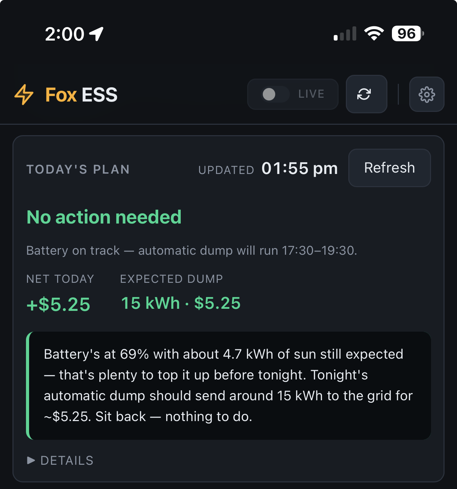
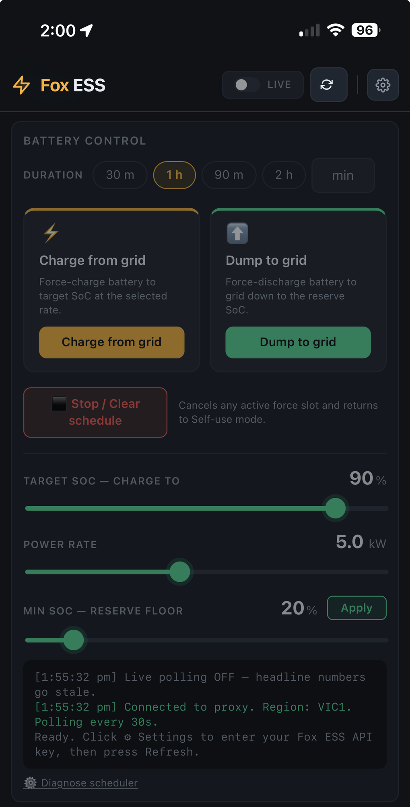
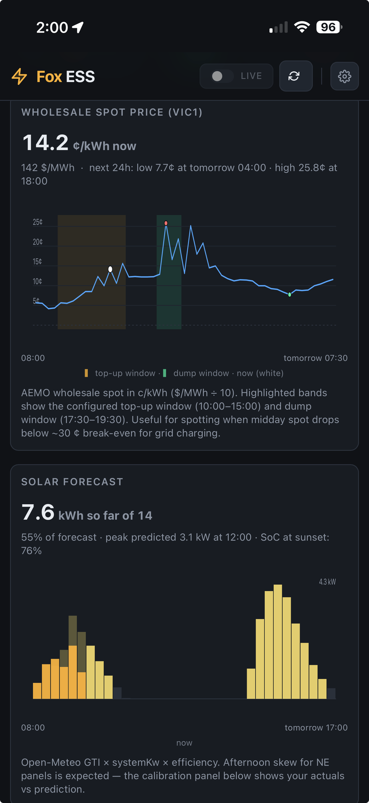
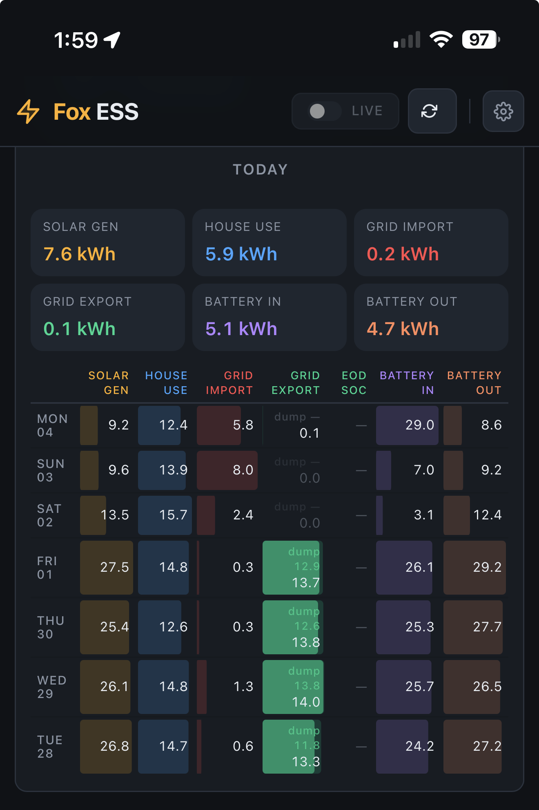

# Fox ESS Management

A self-hosted dashboard and scheduler for Fox ESS hybrid solar inverters. Shows live power flow, today's totals, battery state-of-charge, a 24-hour retail electricity price chart, a solar generation forecast, and a calibration panel — and lets you drive the inverter's charge/discharge scheduler from the browser.

No npm dependencies. No build step. No database.

> **⚠ Australia / AEMO only.** Price data comes from the Australian Energy Market Operator (AEMO NEM) via nemweb. If you're not on the NEM (most of Australia, excluding WA and NT), only the Fox ESS parts will be useful — the price charts will be empty.

## Screenshots

<table>
  <tr>
    <td><br/><sub><b>Live power flow</b> — animated connections, battery SoC ring, today's totals</sub></td>
    <td><br/><sub><b>Today's Plan</b> — midday recommendation engine with plain-English narrative</sub></td>
    <td><br/><sub><b>Battery Control</b> — force charge or dump to grid, auto-stop on SoC threshold</sub></td>
  </tr>
  <tr>
    <td><br/><sub><b>Price chart + solar forecast</b> — AEMO spot with top-up/dump windows highlighted</sub></td>
    <td><br/><sub><b>Weekly totals</b> — 7-day energy grid with heat-map bars and dump-window export</sub></td>
    <td></td>
  </tr>
</table>

## Features

- Live power flow visualization with animated SVG connections
- Today's totals (generation, house use, grid import/export, battery in/out)
- Electricity price chart: AEMO spot + retail estimate with TOU markup, 6 h history and 18 h forecast
- Solar PV forecast (Open-Meteo tilted-irradiance model)
- Solar calibration panel — weighted `actual / ideal` fit across N days, one-click apply
- Scheduler control: force-charge and dump-to-grid with auto-stop, stop/clear, min-SoC, target SoC
- Read-only public view + admin-password-gated writes
- Optional push notifications (ntfy.sh) when the scheduler acts

## What you'll need

- A Fox ESS hybrid inverter connected to Fox ESS Cloud
- A Fox ESS API key — from https://www.foxesscloud.com → **User Center → API Management**
- The serial number of your inverter (shown on the inverter and in the Fox app)
- Either Docker (recommended) or Node.js 18+

---

## Quick start

### Guided setup (easiest)

Clone the repo and run the interactive setup script — it asks the questions, writes the config files, and starts Docker for you:

```bash
git clone https://github.com/VectorXYZing/fox-ess-management.git
cd fox-ess-management
bash setup.sh
```

Then open **http://localhost:8080**.

### Manual Docker setup

```bash
git clone https://github.com/VectorXYZing/fox-ess-management.git
cd fox-ess-management
cp .env.example .env          # set ADMIN_PASSWORD
cp config.example.json config.json
docker compose up -d
```

Open http://localhost:8080, click ⚙ Settings, enter your admin password, and fill in your Fox ESS credentials. Changes save to `config.json` immediately.

### Without Docker

```bash
cp config.example.json config.json
ADMIN_PASSWORD='something-long-and-random' node proxy.js
```

### Environment variable config

All key settings can be passed as environment variables instead of (or to override) `config.json`. Useful for NAS, cloud, or Docker deployments where mounting a file is awkward:

```bash
docker run -d \
  -e ADMIN_PASSWORD=yourpassword \
  -e FOX_API_KEY=your-api-key \
  -e DEVICE_SN=your-serial \
  -e AEMO_REGION=VIC1 \
  -e LATITUDE=-37.81 \
  -e LONGITUDE=144.96 \
  -e SYSTEM_KW=10 \
  -e BATTERY_KWH=20 \
  -p 8080:8080 \
  ghcr.io/vectorxyzing/fox-ess-management:latest
```

| Variable | Description |
|----------|-------------|
| `ADMIN_PASSWORD` | Password for write access (required) |
| `FOX_API_KEY` | Fox ESS API key |
| `DEVICE_SN` | Inverter serial number |
| `AEMO_REGION` | NEM region (`VIC1` `NSW1` `QLD1` `SA1` `TAS1`) |
| `TIMEZONE` | e.g. `Australia/Melbourne` |
| `LATITUDE` / `LONGITUDE` | Location for solar forecast |
| `SYSTEM_KW` | Solar system size in kW |
| `BATTERY_KWH` | Battery capacity in kWh |

---

## How the lock system works

- **Anyone who reaches the URL** sees live power flow, today's totals, retail prices, and the solar forecast. They can click Refresh.
- **Anything that changes state** (Live polling, force charge/dump, scheduler, Settings) requires the admin password. Click any locked control to be prompted.
- `/api/settings/verify` rate-limits failed attempts per IP (5 attempts per 5 minutes → 30 s backoff).

## Exposing it publicly

### Option 1 — Tailscale Funnel (recommended)

Free, no port-forwarding, valid HTTPS certs, works behind CGNAT.

1. `curl -fsSL https://tailscale.com/install.sh | sudo sh` on the Pi, then `sudo tailscale up --ssh`.
2. In the Tailscale admin console, enable **HTTPS Certificates** under DNS settings, and enable **Funnel**.
3. `sudo tailscale funnel --bg 8080`
4. Tailscale prints a public URL — share that.

### Option 2 — Cloudflare Tunnel

Also free, also works behind CGNAT. Install `cloudflared` on the Pi, create a tunnel in the Zero Trust dashboard, and add a public hostname routing to `http://localhost:8080`. For extra protection, put Cloudflare Access in front and require email OTP.

### Option 3 — LAN only

Just run it and only visit from inside your home network. No tunnel needed.

## Running on a Raspberry Pi

See **[docs/pi-setup.md](docs/pi-setup.md)** for a complete step-by-step guide including Docker install, Tailscale Funnel, and keeping the image up to date.

A Pi 3B+ or newer with 1 GB+ RAM has plenty of headroom (this app uses ~50–80 MB idle). A Pi 5 barely notices it alongside other services like PiAware / graphs1090.

If something else on the Pi is already using port 8080 (PiAware's lighttpd commonly is), change the host mapping in `docker-compose.yml` — e.g. `"8081:8080"` — before `docker compose up -d`.

## Security notes

- **Change the default admin password** for any deployment that isn't strictly on your LAN. The app shows a red banner in Settings if you're still using `letpscontrol`.
- The admin password gates writes and settings, not reads. If you don't want the dashboard itself public, put it behind Cloudflare Access, Tailscale auth, or just don't enable Funnel.
- `.env` and `config.json` are in `.gitignore`. Don't commit them.
- API keys are stored in `config.json`. Anyone with shell access to the host or the admin password can read them.

## Project layout

```
proxy.js              HTTP server — routes only, ~150 lines
index.html            Complete single-page dashboard (vanilla JS, no build step)
config.json           Runtime config (created from config.example.json on first start)
config.example.json   Template config, safe to commit
Dockerfile            Container build (no OS dependencies — pure Node.js)
docker-compose.yml    Container run
.env.example          Template for ADMIN_PASSWORD

lib/
  utils.js            Shared pure helpers: Cache class, CSV parser, timezone
                      utilities, HTTPS helpers, pure-JS ZIP extractor
  config.js           Config load/save/merge, path constants, cache-clear registry
  auth.js             Admin password check, brute-force rate limiter
  notifications.js    ntfy.sh push notifications
  fox-client.js       Fox ESS Open API client: signing, serial throttle queue,
                      per-endpoint cache, inflight deduplication, proxy handler
  aemo.js             AEMO history (DISPATCHIS) + forecast (PREDISPATCHIS) via nemweb
  solar.js            Open-Meteo solar forecast, calibration, remaining-kWh helper
  soc-history.js      Daily min-SoC snapshots (JSONL persistence + Fox backfill)
  week-report.js      Last N days of daily energy totals, dump-window feedin
  recommendation.js   Midday top-up advisor: energy budget, AEMO window search,
                      narrative generator

data/
  soc-history.jsonl   Persisted daily minimum SoC records
state/
  dump-history.json   Persisted per-day dump-window feedin values
```

## HTTP endpoints

| Method | Path | Notes |
|--------|------|-------|
| `GET`  | `/` | Dashboard |
| `GET`  | `/api/config` | Non-secret config summary (aemoRegion, pollSeconds, battery, solar.systemKw, etc.) |
| `POST` | `/api/fox/<foxPath>` | Authenticated proxy to Fox ESS Cloud API with per-endpoint caching and a 2 s serial throttle. **Writes require admin password.** |
| `GET`  | `/api/aemo/current` | AEMO 5-min live summary (all regions) |
| `GET`  | `/api/aemo/history` | ~14 h of 30-min-spaced dispatch prices for the configured region |
| `GET`  | `/api/aemo/forecast` | ~20 h AEMO predispatch price forecast for the configured region |
| `GET`  | `/api/solar` | Open-Meteo solar forecast for the configured location |
| `GET`  | `/api/solar/calibration?days=N` | Last N days of actual vs ideal generation (efficiency fit) |
| `GET`  | `/api/soc-history?days=N` | Daily minimum SoC for the last N days |
| `POST` | `/api/soc-history/snapshot` | Manually trigger today's min-SoC lock-in. **Admin only.** |
| `GET`  | `/api/report/week?days=N` | Last N days of daily energy totals |
| `GET`  | `/api/recommendation` | Current midday top-up recommendation |
| `GET`  | `/api/settings` | Full config (API key masked). **Admin only.** |
| `POST` | `/api/settings` | Save full config. **Admin only.** |
| `POST` | `/api/settings/verify` | Check admin password (rate-limited per IP) |
| `POST` | `/api/notify/test` | Send a test ntfy notification. **Admin only.** |

## Architecture notes

### No `unzip` binary required
AEMO's nemweb files are standard ZIP archives. Previous versions shelled out to
the OS `unzip` command (`execFileSync`). The current version uses a pure-JS
parser built on Node's built-in `zlib.inflateRawSync` — no system dependencies,
no temp files, works on any platform Node.js runs on.

### Fox API throttling
The Fox Open API allows ~1440 calls/day and ~30/min per key. All Fox calls are
serialised through a promise-chain throttle that enforces a minimum 2-second gap
between consecutive upstream calls. Read endpoints are also cached
(25 s – 5 min depending on the endpoint) so multiple browser tabs share a single
upstream fetch.

### Cache invalidation
Each `lib/` module registers a `clearCache()` callback with `config.js` via
`onConfigSaved()`. When the Settings form saves new credentials or region,
`saveConfig()` fires all callbacks automatically — no stale data from the
previous configuration can leak through.

### Midday recommendation engine
The engine runs on a 15-minute tick, active 10:30–14:30 local time. It:
1. Reads the current SoC from Fox live telemetry
2. Integrates remaining solar from Open-Meteo through sunset
3. Estimates overnight house load from a rolling 7-day average
4. Computes a surplus/shortfall against a full evening dump + reserve SoC
5. If short, scans the AEMO predispatch forecast for the cheapest contiguous
   charge window and checks whether round-trip arbitrage is profitable
6. Produces a headline, one-liner, and full plain-English narrative for the UI

The engine is read-only and never writes to Fox.

## License

MIT.
